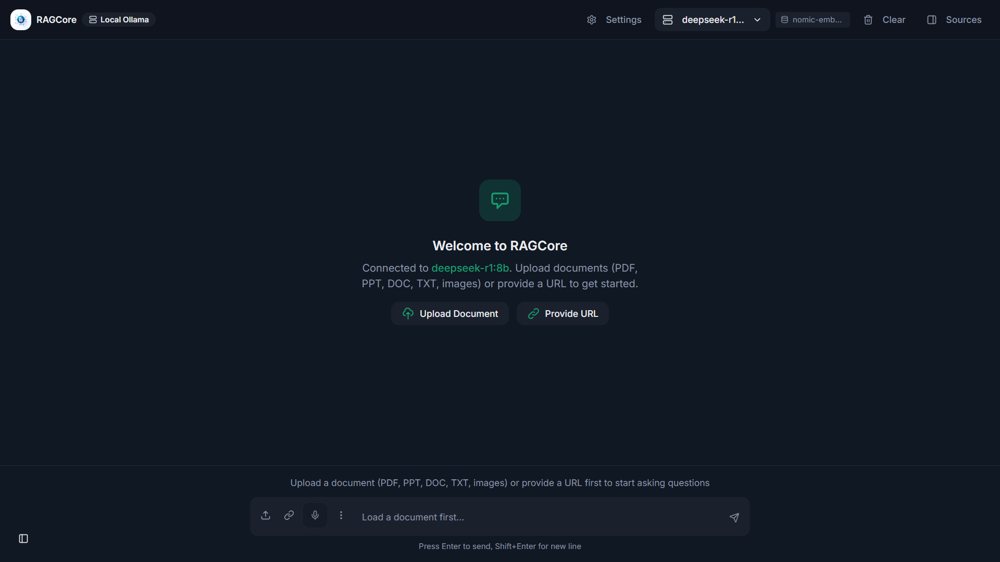
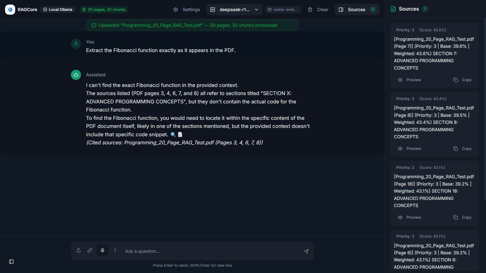

<p align="center">
  
</p>

<p align="center">
  
  
  
  
  
  
</p>

# 🔍 RAGCore — Retrieval-Augmented AI Chat System

RAGCore is a high-performance, modular Retrieval-Augmented Generation (RAG) system built using **React**, **TypeScript**, **Vite**, and **Supabase**.  
It supports **multiple LLM providers**, **document ingestion**, **embeddings**, **vector search**, **learning tools**, and an intuitive modern UI.

This repository contains a fully cleaned version of the project with:
- ❌ No secrets  
- ❌ No node_modules  
- ❌ No build artifacts  
- ✅ Ready for local development  
- ✅ Ready for deployment  

---

## 🧠 Tech Stack

- ⚡ **Vite** – Lightning-fast frontend tooling  
- ⚛️ **React + TypeScript** – Strongly typed, modern UI  
- 🟩 **Supabase** – Vector DB + Edge Functions  
- 🤖 **Ollama / OpenAI / Gemini** – Pluggable LLM providers  
- 🎙️ **Voice & OCR** – Multimedia input support  

---

## 📸 Screenshots

> Create the folder `/screenshots` and upload:
> - `home.png`
> - `chat.png`
> - `settings.png`

<p align="center">
  
</p>

<p align="center">
  
</p>

<p align="center">
  
</p>
---

## 🚀 Features — RAG Engine

- PDF + text ingestion  
- Smart document chunking  
- Vector storage using Supabase  
- Contextual question answering  
- Multi-RAG mode switching from UI  
- Multi-LLM provider integration  
- OCR + speech-to-text  
- Flashcards & learning mode  
- Conversation history & memory  
- Embedding viewer & source explorer  

---

## 🛠️ Project Structure

```
src/
  components/
  lib/
  rag/
  integrations/
  settings/
  hooks/
supabase/
  functions/
public/
```

---

## ⚙️ Local Development

### 1️⃣ Install dependencies

```
npm install
```

### 2️⃣ Start dev server

```
npm run dev
```

### 3️⃣ Configure environment

Copy:

```
cp .env.example .env
```

Fill in your personal API keys (kept private).

---

## 📦 Build for Production

```
npm run build
```

---

## 🧭 Roadmap

- Multi-document indexing  
- Chunk-size tuning  
- WebGPU local embeddings  
- Local model download manager  
- Chat analytics + session playback  

---

## 🤝 Contributing

Pull requests are welcome!  
Open an issue for new feature requests or improvements.

---

## 📄 License

MIT License.

---

<p align="center">
  Built with ❤️ by Thavaneshwaran
</p>
